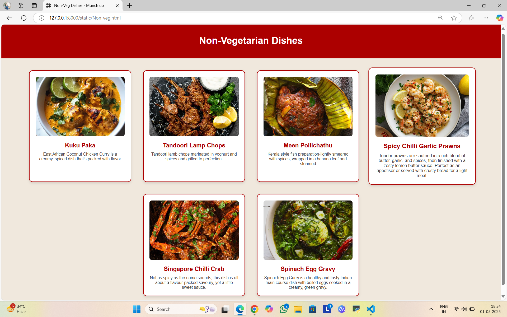
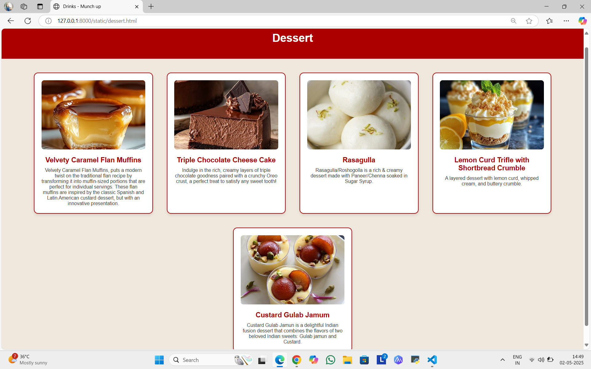
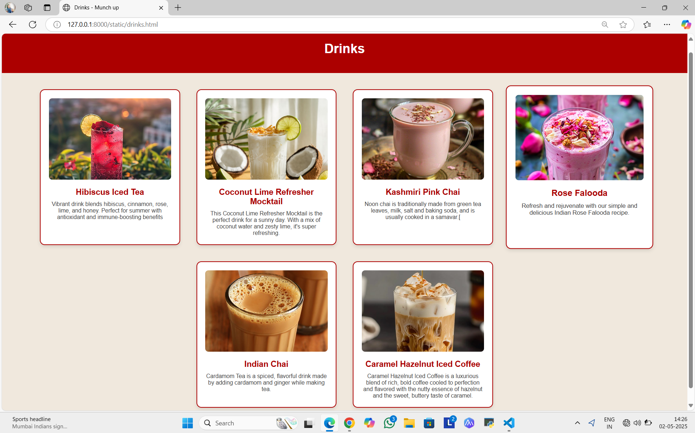
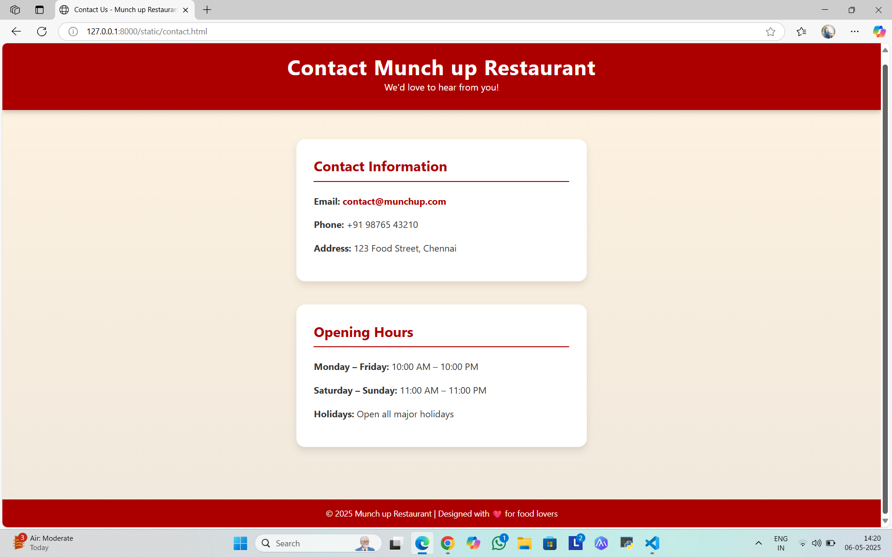
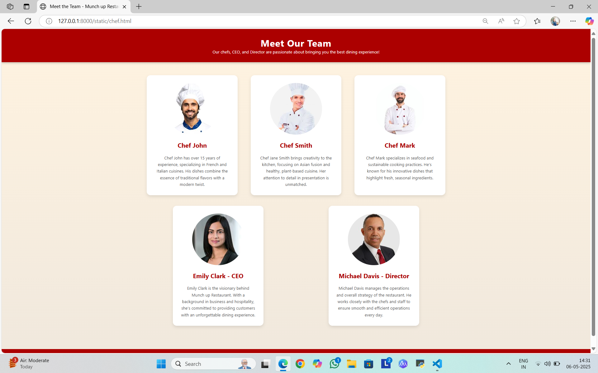

# Ex.07 Restaurant Website
# Date:28/04/25
# AIM:
To develop a static Restaurant website to display the food items and services provided by them.

# DESIGN STEPS:
## Step 1:
Requirement collection.

## Step 2:
Creating the layout using HTML and CSS.

## Step 3:
Updating the sample content.

## Step 4:
Choose the appropriate style and color scheme.

## Step 5:
Validate the layout in various browsers.

## Step 6:
Validate the HTML code.

## Step 7:
Publish the website in the given URL.

# PROGRAM:
```
home.html
<!DOCTYPE html>
<html>
<head>
  <title>Munch up Restaurant</title>
  <style>
    html, body {
      margin: 0;
      padding: 0;
      height: 100%;
      font-family: Arial, sans-serif;
      display: flex;
      flex-direction: column;
    }

    .frame-container {
      flex: 1;
      display: flex;
      flex-direction: column;
    }

    .top {
      background-color: #ac0000;
      color: white;
      display: flex;
      align-items: center;
      justify-content: space-between;
      padding: 10px 20px;
    }

    .left-section {
      display: flex;
      align-items: center;
    }

    .logo {
      width: 110px;
      height: auto;
      margin-right: 20px;
    }

    .nav-links {
      display: flex;
      gap: 50px;
    }

    .nav-links a {
      color: white;
      text-decoration: none;
      font-weight: bold;
      font-size: 16px;
    }

    .nav-links a:hover {
      text-decoration: underline;
    }

    .right-section {
      display: flex;
      align-items: center;
      gap: 10px;
    }

    .search-input {
      padding: 6px 10px;
      border-radius: 5px;
      border: none;
      font-size: 14px;
    }

    .search-button {
      padding: 6px 12px;
      background-color: white;
      color: #ac0000;
      border: none;
      border-radius: 5px;
      cursor: pointer;
      font-size: 14px;
    }

    .search-button:hover {
      background-color: #e2e2e2;
    }

    .profile-img {
      width: 50px;
      height: 50px;
      border-radius: 50%;
    }

    .bottom {
      background-color: #f0e8dd;
      display: flex;
      justify-content: center;
      align-items: center;
      padding: 90px 0;
    }

    .category-list {
      display: flex;
      justify-content: space-around;
      align-items: center;
      flex-wrap: wrap;
      gap: 50px;
    }

    .category-item {
      width: 300px;
      height: 300px;
      border-radius: 8px;
      background-color: #ac0000;
      color: white;
      text-align: center;
      display: flex;
      flex-direction: column;
      justify-content: center;
      align-items: center;
      text-decoration: none;
      font-weight: bold;
      font-size: 16px;
      transition: transform 0.3s, background-color 0.3s;
    }

    .category-item:hover {
      background-color: #d10000;
      transform: scale(1.05);
    }

    .category-image {
      width: 230px;
      height: 220px;
      object-fit: cover;
      margin-bottom: 30px;
    }

    .category-item span {
      font-size: 16px;
      font-weight: bold;
      color: #f0e8dd;
    }

    .contact-section {
      background-color: #ac0000;
      color: white;
      padding: 30px 20px;
    }

    .contact-content {
      max-width: 1200px;
      margin: auto;
      display: flex;
      justify-content: space-between;
      flex-wrap: wrap;
      gap: 40px;
    }

    .contact-content div {
      min-width: 250px;
    }

    .contact-content h3 {
      margin-bottom: 10px;
      border-bottom: 2px solid white;
      padding-bottom: 5px;
    }
  </style>
</head>
<body>
  <!-- Main Container -->
  <div class="frame-container">
    <!-- Top Header -->
    <div class="top">
      <div class="left-section">
        
        <div class="nav-links">
          <a href="home.html">Home</a>
          <a href="order.html">Order</a>
          <a href="menu.html">Menu</a>
          <a href="chef.html">Chef</a>
          <a href="contact.html">Contact</a>
        </div>
      </div>
      <div class="right-section">
        <input type="text" id="searchInput" class="search-input" placeholder="Search...">
        <button class="search-button" onclick="search()">Search</button>
        
      </div>
    </div>

    <!-- Category Section -->
    <div class="bottom">
      <div class="category-list">
        <a href="Veg.html" class="category-item">
          
          <span>Vegetarian</span>
        </a>
        <a href="Non-veg.html" class="category-item">
          
          <span>Non-Veg</span>
        </a>
        <a href="drinks.html" class="category-item">
          
          <span>Drinks</span>
        </a>
        <a href="dessert.html" class="category-item">
          
          <span>Dessert</span>
        </a>
      </div>
    </div>
  </div>

  <!-- Contact Section Always at Bottom -->
  <div class="contact-section">
    <div class="contact-content">
      <div>
        <h3>Contact Us</h3>
        <p>Email: contact@munchup.com</p>
        <p>Phone: +91 98765 43210</p>
        <p>Address: 123 Food Street, Chennai</p>
      </div>
      <div>
        <h3>Opening Hours</h3>
        <p>Mon - Fri: 10:00 AM - 10:00 PM</p>
        <p>Sat - Sun: 11:00 AM - 11:00 PM</p>
      </div>
    </div>
  </div>

  <script>
    function search() {
      const query = document.getElementById("searchInput").value;
      if (query) {
        alert("Searching for: " + query);
      } else {
        alert("Please enter a search term.");
      }
    }
  </script>
</body>
</html>

veg.html

<!DOCTYPE html>
<html>
<head>
  <title>Vegetarian Dishes - Munch up</title>
  <style>
    body {
      margin: 0;
      font-family: Arial, sans-serif;
      background-color: #f0e8dd;
    }

    .header {
      background-color: #ac0000;
      color: white;
      padding: 20px;
      text-align: center;
    }

    .dish-container {
      display: flex;
      flex-wrap: wrap;
      justify-content: center;
      gap: 40px;
      padding: 40px;
    }

    .dish-box {
      width: 300px;
      background-color: #ffffff;
      border: 2px solid #ac0000;
      border-radius: 12px;
      padding: 20px;
      box-shadow: 0 4px 8px rgba(0,0,0,0.1);
      text-align: center;
      transition: transform 0.2s;
    }

    .dish-box:hover {
      transform: scale(1.05);
    }

    .dish-image {
      width: 100%;
      height: 200px;
      object-fit: cover;
      border-radius: 8px;
    }

    .dish-name {
      font-size: 20px;
      font-weight: bold;
      margin-top: 15px;
      color: #ac0000;
    }

    .dish-description {
      font-size: 14px;
      color: #444;
      margin-top: 10px;
    }
  </style>
</head>
<body>

  <div class="header">
    
    <h1>Vegetarian Dishes</h1>
  </div>

  <div class="dish-container">
    <div class="dish-box">
      
      <div class="dish-name">Marinated grilled vegetables</div>
      <div class="dish-description">Marinated grilled vegetables with whipped goat cheese - eggplants, peppers, zucchini, asparagus, and onions, marinated and grilled till soft on the inside and charred on the outside, then doused in garlicky marinade, and served with whipped goat cheese on the side.</div>
    </div>

    <div class="dish-box">
      
      <div class="dish-name">Coconut Curry Dumpling Soup</div>
      <div class="dish-description">Pair frozen dumplings or pot stickers with a curry and coconut infused broth, plus a colorful mix of veggies, for a speedy, satisfying supper.</div>
    </div>

    <div class="dish-box">
      
      <div class="dish-name">Dum Aloo</div>
      <div class="dish-description">Dum Aloo is a delicious creamy gravy where fried potatoes are dunked in a rich onion tomato based curry. This shahi recipe is easy to make at home and use basic ingredients. Here is how to make it in restaurant or dhaba style.</div>
    </div>

    <div class="dish-box">
      
      <div class="dish-name">Masala Tikka Pasta</div>
      <div class="dish-description">Tikka Masala Pasta is a creamy tomato onion gravy coated with boiled pasta, making for one of the most delicious fusion Indian-Italian dishes.</div>
    </div>

    <div class="dish-box">
        
        <div class="dish-name">Gobi Manchurian</div>
        <div class="dish-description">Gobi Manchurian is an Indo-Chinese appetizer and this version will blow your mind! It features ridiculously crispy and crunchy fried cauliflower coated in a sweet, tangy, umami-rich chili sauce with lots of aromatics. A MUST-make for your next party or get-together!
        </div>
      </div>

      <div class="dish-box">
        
        <div class="dish-name">nawabi paneer curry</div>
        <div class="dish-description">Nawabi Paneer is a restaurant-style Indian paneer curry where paneer pieces are simmered in a rich and creamy white sauce. Serve this Mughlai-inspired dish with naan or lachha paratha
        </div>
      </div>
  </div>

</body>
</html>

contact.html
<!DOCTYPE html>
<html lang="en">
<head>
  <meta charset="UTF-8">
  <title>Contact Us - Munch up Restaurant</title>
  <style>
    * {
      margin: 0;
      padding: 0;
      box-sizing: border-box;
    }

    body {
      font-family: 'Segoe UI', Tahoma, Geneva, Verdana, sans-serif;
      background: linear-gradient(to bottom, #fff3e0, #f0e8dd);
      color: #333;
      display: flex;
      flex-direction: column;
      min-height: 100vh;
    }

    header {
      background-color: #ac0000;
      color: white;
      padding: 30px 20px;
      text-align: center;
      box-shadow: 0 4px 8px rgba(0,0,0,0.2);
    }

    header h1 {
      font-size: 36px;
      letter-spacing: 1px;
    }

    .main-container {
      max-width: 1200px;
      margin: 50px auto;
      display: flex;
      flex-wrap: wrap;
      justify-content: space-around;
      gap: 40px;
      padding: 0 20px;
      flex-grow: 1; /* Ensure the content area takes up available space */
    }

    .contact-box {
      background-color: white;
      padding: 30px;
      border-radius: 15px;
      box-shadow: 0 6px 12px rgba(0,0,0,0.1);
      width: 100%;
      max-width: 500px;
      transition: transform 0.3s ease;
    }

    .contact-box:hover {
      transform: translateY(-5px);
    }

    .contact-box h2 {
      color: #ac0000;
      margin-bottom: 20px;
      border-bottom: 2px solid #ac0000;
      padding-bottom: 10px;
      font-size: 24px;
    }

    .contact-box p {
      margin-bottom: 15px;
      font-size: 16px;
      line-height: 1.6;
    }

    .contact-box a {
      color: #ac0000;
      text-decoration: none;
      font-weight: bold;
    }

    .contact-box a:hover {
      text-decoration: underline;
    }

    footer {
      background-color: #ac0000;
      color: white;
      text-align: center;
      padding: 15px;
      margin-top: 40px;
      font-size: 14px;
    }

    @media (max-width: 768px) {
      .main-container {
        flex-direction: column;
        align-items: center;
      }
    }
  </style>
</head>
<body>

  <header>
    <h1>Contact Munch up Restaurant</h1>
    <p>We'd love to hear from you!</p>
  </header>

  <section class="main-container">
    <div class="contact-box">
      <h2>Contact Information</h2>
      <p><strong>Email:</strong> <a href="mailto:contact@munchup.com">contact@munchup.com</a></p>
      <p><strong>Phone:</strong> +91 98765 43210</p>
      <p><strong>Address:</strong> 123 Food Street, Chennai</p>
    </div>

    <div class="contact-box">
      <h2>Opening Hours</h2>
      <p><strong>Monday – Friday:</strong> 10:00 AM – 10:00 PM</p>
      <p><strong>Saturday – Sunday:</strong> 11:00 AM – 11:00 PM</p>
      <p><strong>Holidays:</strong> Open all major holidays</p>
    </div>
  </section>

  <footer>
    &copy; 2025 Munch up Restaurant | Designed with ❤️ for food lovers
  </footer>

</body>
</html>

Chef.html
<!DOCTYPE html>
<html lang="en">
<head>
  <meta charset="UTF-8">
  <meta name="viewport" content="width=device-width, initial-scale=1.0">
  <title>Meet the Team - Munch up Restaurant</title>
  <style>
    * {
      margin: 0;
      padding: 0;
      box-sizing: border-box;
    }

    body {
      font-family: 'Segoe UI', Tahoma, Geneva, Verdana, sans-serif;
      background: linear-gradient(to bottom, #fff3e0, #f0e8dd);
      color: #333;
      display: flex;
      flex-direction: column;
      min-height: 100vh;
    }

    header {
      background-color: #ac0000;
      color: white;
      padding: 30px 20px;
      text-align: center;
      box-shadow: 0 4px 8px rgba(0,0,0,0.2);
    }

    header h1 {
      font-size: 36px;
      letter-spacing: 1px;
    }

    .team-container {
      max-width: 1200px;
      margin: 50px auto;
      display: flex;
      justify-content: space-around;
      gap: 40px;
      padding: 0 20px;
      flex-grow: 1;
      flex-wrap: wrap;
    }

    .team-box {
      background-color: white;
      padding: 30px;
      border-radius: 15px;
      box-shadow: 0 6px 12px rgba(0,0,0,0.1);
      width: 100%;
      max-width: 350px;
      text-align: center;
      transition: transform 0.3s ease;
    }

    .team-box:hover {
      transform: translateY(-5px);
    }

    .team-box h2 {
      color: #ac0000;
      margin-bottom: 20px;
      font-size: 24px;
    }

    .team-box p {
      font-size: 16px;
      line-height: 1.6;
      color: #555;
    }

    .team-box img {
      width: 200px;
      height: 200px;
      object-fit: cover;
      border-radius: 50%;
      margin-bottom: 20px;
    }

    footer {
      background-color: #ac0000;
      color: white;
      text-align: center;
      padding: 15px;
      margin-top: 40px;
      font-size: 14px;
    }

    @media (max-width: 768px) {
      .team-container {
        flex-direction: column;
        align-items: center;
      }
    }
  </style>
</head>
<body>

  <header>
    <h1>Meet Our Team</h1>
    <p>Our chefs, CEO, and Director are passionate about bringing you the best dining experience!</p>
  </header>

  <section class="team-container">
    <!-- Chef 1 -->
    <div class="team-box">
      
      <h2>Chef John </h2>
      <p>Chef John  has over 15 years of experience, specializing in French and Italian cuisines. His dishes combine the essence of traditional flavors with a modern twist.</p>
    </div>

    <!-- Chef 2 -->
    <div class="team-box">
      
      <h2>Chef Smith</h2>
      <p>Chef Jane Smith brings creativity to the kitchen, focusing on Asian fusion and healthy, plant-based cuisine. Her attention to detail in presentation is unmatched.</p>
    </div>

    <!-- Chef 3 -->
    <div class="team-box">
      
      <h2>Chef Mark </h2>
      <p>Chef Mark specializes in seafood and sustainable cooking practices. He’s known for his innovative dishes that highlight fresh, seasonal ingredients.</p>
    </div>

    <!-- CEO -->
    <div class="team-box">
      
      <h2>Emily Clark - CEO</h2>
      <p>Emily Clark is the visionary behind Munch up Restaurant. With a background in business and hospitality, she’s committed to providing customers with an unforgettable dining experience.</p>
    </div>

    <!-- Director -->
    <div class="team-box">
      
      <h2>Michael Davis - Director</h2>
      <p>Michael Davis manages the operations and overall strategy of the restaurant. He works closely with the chefs and staff to ensure smooth and efficient operations every day.</p>
    </div>
  </section>

  <footer>
    &copy; 2025 Munch up Restaurant | Culinary Excellence in Every Bite
  </footer>

</body>
</html>

```

# OUTPUT:
home.html


veg.html


Non-veg.html



Dessert.html



Drinks.html



contact.html



Chef.html



# RESULT:
The program for designing software company website using HTML and CSS is completed successfully.
